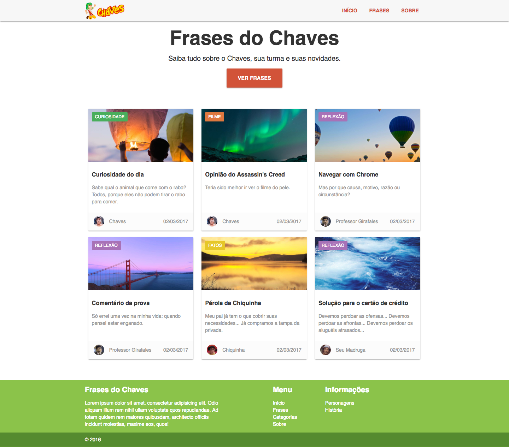
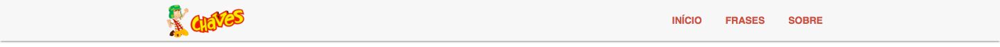

# Prova LM I - HTML & CSS

### OBSERVAÇÕES

Leia as observações a seguir:

* A avaliação será realizada no computador, porém individualmente e em silêncio. Não deve haver nenhum tipo de comunicação entre os alunos;
* Cada questão é expresso através deste formato **QUESTÃO N (O DD%)**, no qual o `N`é o número da questão, o `O` significa que o aluno sentado na cadeira ímpar irá fazer essa questão, e `DD%` informa o critério de pontuação, contudo, a desorganização pode penalizar a pontuação final;
* No arquivo de resposta inclua um bloco de comentário no início de seu conteúdo com o nome e a matrícula do aluno;
* Ao concluir as questões chame o professor para avaliar a prova;
* Depois da avaliação envie os arquivos num diretório compactado, seguindo o formato de nome **&lt;ALUNO-MATRICULA&gt;** para o email **lucachaves+avaliacoeslm20162@gmail.com** ou **petroniofco+avaliacoeslm20162@gmail.com** com:

> **Assunto:** [IFPB] Prova I LM

> **Conteúdo:** Os arquivos da prova do aluno < nome do aluno > (< matrícula >) estão em anexo.

### DESCRIÇÃO DA PROVA

As questões da prova serão relacionadas ao layout da página Web da Figura 1, no qual os recursos necessários para a página serão disponibilizados através deste [link](https://github.com/ifpb/lm/blob/master/assessment/prova-html-css/code.tar.gz).

*Figura 1 - Layout da página*

Resumidamente o layout é dividido em algumas áreas: a barra de navegação, o cabeçalho, a área principal de conteúdo e o rodapé. Cada uma dessas áreas apresentam itens com aparências específicas, que devem ser preservados o mais próximo possível do comportamento  estrutural e do estilo apresentado na Figura 1.

Para facilitar nesse processo, cada questão abordará um item específico, no qual seu conteúdo será previamente disponibilizado por meio dos arquivos baixados. Por exemplo, uma das questões solicitará a criação e estilização da barra de menu, e como ponto de partida, os arquivos baixados já oferecem o conteúdo a ser inserido, como exibido a seguir:

> TODO barra de navegação

> img/logo-chaves.png

> Início

> Frases

> Sobre

para que seja utilizado pelo aluno na criação da estrutura do HTML e estilização do CSS da barra de menu.

### QUESTÕES

**QUESTÃO 1 (O 25%) -** No Layout da Figura 1 é possível identificar a barra de menu do site. Através dos arquivos obtidos, veja que o layout não apresenta nem HTML e nem CSS da barra, então, crie a aparência da barra de menu conforme a Figura 2 considerando que:

  * O logotipo da página deve ser colocado no ínicio da barra;
  * A lista de menu deve ser alinhado à direita;
  * No menu a cor de texto deve ser #d25339, o texto deve estar em caixa alta e negrito, além disso, o link não deve conter sublinhado;
  * Inclua a classe pré-existente box-shadow na barra de menu;
  * Os distanciamentos e aparência entre os elementos devem ser preservados.

*Figura 2 - Barra de menu.*

**QUESTÃO 2 (O, E 25%) -** Para criação do cabeçalho inicial da página, presente na Figura 3, é necessário:

  * Deixar todos os elementos centralizados;
  * O título deve conter tamanho de 3.5rem e o subtítulo de 1.2rem;
  * O botão "Ver frases" possui a altura de 54px, não deve ser sublinhado, raio da borda de 2px, espaçamento interna de borda com 0 2rem, e plano de fundo de #d25339;
  * Os distanciamentos e aparência entre os elementos devem ser preservados.

*Figura 3 - Cabeçalho inicial da página.*

**QUESTÃO 3 (O,E 50%) -** Outra área importante do layout da Figura 1 é a exibição das frases, apresentado através do recorte das Figuras 4 e 5. Todos os textos necessários para essa ilustração estão disponibilizadas, então, faça com que os distanciamentos e aparência entre os elementos sejam preservados e construa:

  **a. (25%)** Uma mensagem conforme a Figura 4, de modo que:

  * A mensagem é definido em um artigo em três regiões: cabeçalho, conteúdo e rodapé;
  * O artigo deve conter a classe box-shadow e tamanho de 345px;
  * O cabeçalho do artigo deve conter um plano de fundo proposto que se ajuste a largura da imagem;
  * O cabeçalho do artigo deve conter uma indicação de categoria sem sublinhado, recuo interno da borda de 7px 9px 6px, margem de 10px 0 0 10px, com negrito e fonte Oxygen;
  * Cada categoria já possui uma lista de cores pré-definidos através de classes no arquivo CSS.
  * No conteúdo do artigo a frase deve possuir cor de texto com #999;
  * No rodapé do artigo o recuo interno da borda possui 10px 15px, o plano de fundo é de #fcfcfc e a cor de text é #999;
  * A imagem do autor da frase deve possuir raio da borda de 50%.

*Figura 4 - Exibição de um mensagem.*

  **b. (25%)** Uma lista de mensgens em grid conforme a Figura 5, de modo que a largura de cada artigo deve ser de 31% e margem de 1%, além disso, sua exibição deve ser feita conforme o grid.

*Figura 5 - Lista de mensagens em grid.*

**QUESTÃO 4 (E 25%) -** Por fim, o Layout da Figura 1 possui na parte inferior o rodapé tal como a Figura 6. Então para sua construção deve-se considerar que:

  * O texto de descrição devem ocupar 40% de largura, enquanto que a lista de links deve ser de 15% de largura;
  * O texto de descrição deve possuir uma margin de 15% em relação a lista de links;
  * Os distanciamentos e aparência entre os elementos devem ser preservados.

*Figura 6 - Roda pé da página.*

